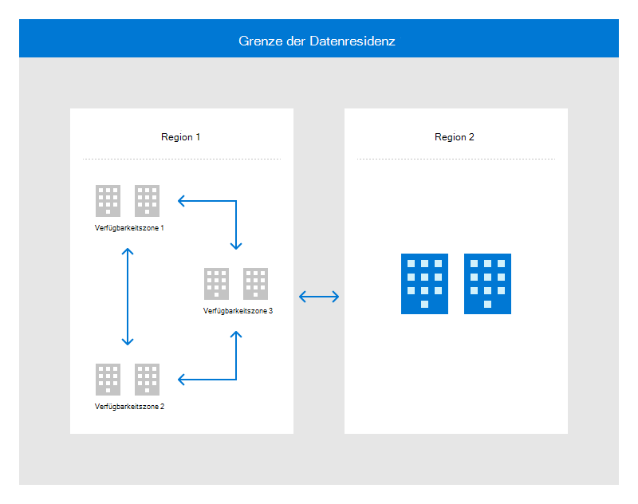

# Architektur und Infrastruktur von Rechenzentren

Microsoft-Rechenzentren sind so konzipiert, dass sie eine Strategie der umfassenden Verteidigung implementieren, die mehrere Schutzebenen verwendet, um unsere Cloudarchitektur und unterstützende Infrastruktur zuverlässig zu schützen. Redundanz ist in alle Systeme auf mehreren Ebenen integriert, um die Verfügbarkeit von Rechenzentren zu unterstützen.

Microsoft verfügt über hochgradig gesicherte Rechenzentren, die weltweit verteilt sind, und erstellt eine verteilte Rechenzentrumsinfrastruktur, die Tausende von Onlinediensten unterstützt. Diese global verteilte Infrastruktur wurde entwickelt, um Anwendungen näher an die Benutzer zu bringen, die Datenaufbewahrung zu erhalten und umfassende Compliance- und Resilienzoptionen für Kunden zu bieten.

Regionen sind Gruppen von Rechenzentren, die über ein massives und robustes Netzwerk miteinander verbunden sind. Regionen sind in Regionen unterteilt. Kunden mit bestimmtem Datenaufbewahrungs- und Compliancestatus müssen in der Lage sein, ihre Daten und Anwendungen geschlossen zu halten. Dank der integrierten Fehlertoleranz können Regionen vollständige Regionsfehler über ihre Verbindung mit der dedizierten Netzwerkinfrastruktur mit hoher Kapazität beheben.

Physisch getrennte Standorte innerhalb einer Region werden als Verfügbarkeitszonen bezeichnet, die jeweils aus einem oder mehreren Rechenzentren bestehen, die mit unabhängiger Energie, Energie und Netzwerk ausgestattet sind. Verfügbarkeitszonen ermöglichen die Ausführung unternehmenskritischer Anwendungen mit hoher Verfügbarkeit und Replikation mit geringer Latenz.

Die folgende Abbildung zeigt, wie die globale Infrastruktur Regionen und Verfügbarkeitszonen innerhalb derselben Datenaufbewahrungsgrenze für hohe Verfügbarkeit, Notfallwiederherstellung und Sicherung paart.

Geografisch verteilte Rechenzentren ermöglichen Es Microsoft, Dienste kundennäher zu machen, die Netzwerklatenz zu reduzieren und georedundante Sicherungen und Failovers zu ermöglichen.

## Verfügbarkeit

Microsoft-Rechenzentren sind so konzipiert, dass sie eine Verfügbarkeit von 99,999 % bereitstellen, um die SLAs und Serviceanforderungen von Kunden zu erfüllen. Microsoft investiert erheblich in den globalen Betrieb, die Verwaltung, die Netzwerke und die Infrastruktur von Einrichtungen, die 24 x 7 x 365-Dienste bereitstellen.

## Compliancestandards und -anforderungen

Microsoft hat über 15 Milliarden USD in den Aufbau unserer globalen Infrastruktur und über 9 Milliarden USD in Forschung und Entwicklung investiert, um die Effizienz zu steigern und Innovationen voranzutreiben. Daher entwickeln sich die Rechenzentren von Microsoft in einem schnelleren Tempo als viele Einrichtungen in der Branche und folgen daher nicht den gesetzlichen Anforderungen, die von herkömmlichen Rechenzentrumsstandards beschrieben werden. Zusätzlich zu den vielen betriebsbereiten Einblicken, die mit einem der weltweit größten Rechenzentrumsportfolios verbunden sind, verwendet Microsoft IEEE Gold Book-Daten und Zuverlässigkeitssimulationssoftware von Drittanbietern, um unsere Rechenzentrumsdesignstandards kontinuierlich zu verbessern. Microsoft-Rechenzentren werden im Rahmen mehrerer behördlicher Prüfungen, die im Compliance-Portfolio genannt werden, umfassend geprüft. Der Fälligkeitsgrad in Microsoft-Rechenzentren kann über das Compliance-Portfolio und insbesondere die ISO 22301-Zertifizierung zur Ausfallsicherheit ausgewertet werden.

Während Microsoft Programme in Übereinstimmung mit der ANSI/TIA-942-Telekommunikationsinfrastruktur von Datacenters Standard betreibt, gelten Teile dieses Standards nicht für Microsoft oder stehen in Konflikt mit anderen gesetzlichen und/oder länderspezifischen Anforderungen. Darüber hinaus hat Microsoft einen leistungsbasierten Ansatz gewählt, um die Kundenanforderungen zu erfüllen.

## Daten- und Netzwerkredundanz

Kritische Rechenzentrumseinrichtungen verwenden mehrere Ebenen redundanter Systeme, um Fehler zu beheben und Dienstunterbrechungen zu minimieren. Lokal redundanter Speicher auf Festplattenebene schützt Daten in einer Region, während georedundanter Speicher die regionsübergreifende Redundanz bereitstellt. Um eine zuverlässige Netzwerkkommunikation sicherzustellen, setzt Microsoft unterschiedliche Fibre-Routes und redundante Hardware ein, um wichtige Komponenten vor Fehlern oder Dienstunterbrechungen zu schützen.

Die Georeplikation wird verwendet, um Redundanz an alternativen geografischen Standorten bereitzustellen. Daten werden durch synchrone Replikation von Daten über mehrere Datenbanken in verschiedenen Rechenzentren hinweg abgerufen. Wiederherstellungstests werden für alle Sicherungsdaten durchgeführt, die der Cloud gehören. Die Notfallwiederherstellung erfolgt durch asynchrone Replikation zu einem Rechenzentrum in einer anderen geografischen Region.

## Kapazität

Cloud Operations ist ein dediziertes Kapazitätsteam, das künftige Anforderungen prognostiziert, um sicherzustellen, dass die erforderliche Kapazität strukturiert ist und für die kunden- und interne Nutzung verfügbar ist. Systeme werden überwacht, um eine akzeptable Dienstleistung, Verfügbarkeit, Dienstauslastung, Speichernutzung, Netzwerklatenz und Überwachungsprotokollkapazität sicherzustellen. Microsoft schützt Rechenzentren auch vor den Auswirkungen von Denial-of-Service-Angriffen auf Bandbreite, Transaktionskapazität und Speicherkapazität.

Alle Serviceteams umfassen die Kapazitätsplanung als zentrales Feature ihrer Rechenzentrumsmodelle und Datenreplikationspläne, um sicherzustellen, dass die erforderliche Kapazität für die Informationsverarbeitung, Telekommunikation und Umgebungsunterstützung vorhanden ist.

## Stromversorgung

Die Rechenzentren von Microsoft verfügen über dedizierte unterbrechungsfreie 24 x 7-Stromversorgungen (UPSs) und Notfallstromunterstützung, einschließlich Generatoren vor Ort, die Sicherungsleistung bereitstellen. Sowohl für die unterbrechungsfreien Stromversorgungen als auch für die Generatoren werden regelmäßige Wartungen und Tests durchgeführt, und die Teams haben Vertragsvereinbarungen mit lokalen Anbietern im Hinblick auf die Versorgung mit Notstrom. In Rechenzentren gibt es auch ein dediziertes Facility Operations Center zur Überwachung von Stromsystemen, einschließlich kritischer elektrischer Komponenten.

Microsoft-Rechenzentren sind mit Schutzräumen und entsprechenden Bezeichnungen für Kabel ausgestattet. Die Energieinfrastrukturgeräte werden in Umgebungen platziert, die zum Schutz vor Umweltrisiken entwickelt wurden. Alle Ressourcen tragbarer Onlinedienste müssen gesperrt oder fixiert werden, um Schutz vor Diebstahl- oder Bewegungsschäden zu bieten. Stromkabel werden unter den Stockwerken, in Kabelschachten und in Schränken ausgeführt, um Schutz vor dem Verschieben von Teilen und versehentlichen Beschädigungen zu bieten. Alle elektronischen Leerzeichen befinden sich hinter Kartenlesern oder ggf. zusätzlichen Tastensperren. Zugriffsräume, Außeneingänge und Geräteanlagen werden alle über die Videoüberwachung überwacht. Energiesysteme nutzen redundanz auch als Schutzform, mit mehreren Energie-/Dienstprogramm-Einspeisungen in die Einrichtung und Generatoren und UPS-Systeme.

Für das Informationssystem wird eine langfristige alternative Stromversorgung implementiert, die in der Lage ist, die Stromversorgung in einer minimal erforderlichen Betriebsfunktion aufrechtzuerhalten. Wenn der Strom ausfällt oder auf ein inakzeptables Niveau fällt, werden UPS-Systeme sofort online. Dadurch wird genügend Energie für die Ausführung der Server bereitgestellt, bis die Generatoren übernehmen können. Notfallgeneratoren stellen die Stromversorgung für erweiterte Ausfälle, geplante Wartung und den Betrieb des Rechenzentrums mit Vor-Ort-Verbrauchsreserven bereit, wenn eine Naturkatastrophe auftritt.

Microsoft-Rechenzentren (sowohl geleaste als auch vollständig verwaltete) implementieren Notfallbeleuchtung in Form von zusätzlichem Notlicht auf dedizierten Schaltungen, die von UPS- und Generatorsystemen gesichert werden. Die automatische Notbeleuchtung wird in Übereinstimmung mit dem Life Safety Code der National Fire and Protection Association (NFCPA) oder dem geltenden lokalen Code/Gesetz implementiert. Wenn die Hilfsleistung verloren geht, wird die Notbeleuchtung automatisch auf den Von UPS- und Generator-Systemen bereitgestellten Strom umgeschaltet. Die Notfallbeleuchtungssysteme in den Rechenzentren werden routinemäßig gewartet, um sicherzustellen, dass sie in ordnungsgemäßer Arbeitsreihenfolge bleiben.

## Wartung

Richtlinien und Verfahren für die Systemwartung sind in Übereinstimmung mit dem *Microsoft Online Services Physical and Environmental Security Standard vorhanden.* Alle Microsoft-Geräte und -Systeme werden regelmäßig gewartet, um die Betriebliche Effizienz zu gewährleisten. Die Wartung von Geräten oder Systemen muss gemäß den Empfehlungen des Herstellers, durch autorisiertes Personal durchgeführt und in einem Wartungsticket aufgezeichnet werden.

Es gibt zwei Bestandsteams, die unterschiedliche Systemtypen verwalten:

- **Team für kritische Umgebungen (CRITICAL Environment, CE):**

    - CE ist das Team, das die Einrichtungsverwaltung für stromtechnische, mechanische und physische Systeme bereitstellt, die die Betriebsinfrastruktur der Anlage umfassen. Das CE-Team plant, führt, dokumentiert und überprüft alle Wartungsaktivitäten, die auf CE-Komponenten durchgeführt werden. Microsoft-Rechenzentren verwenden ein computerisiertes System, um Wartungszeitpläne und Arbeitsaufträge zu verwalten.
    - Die Rechenzentrumsverwaltung (Datacenter Management, DCM) ist für alle CE-Wartungen verantwortlich, die entweder vor Ort oder remote durchgeführt werden. Die CE-Wartung wird in erforderlichen Schritt-für-Schritt-Dokumenten mit dem Namen "Methoden der Prozedur" (Methods of Procedure, MOP) vorgeschrieben. MOPs werden vor beginn der Arbeit von der Rechenzentrumsverwaltung überprüft/genehmigt.

- **Websitedienste-Team:**

    - Site Services ist das Team, das die Wartung von Microsoft-Onlinedienstressourcen im Microsoft-Rechenzentrum bereitstellt. Das DC Site Services-Team bietet einen intelligenten Hands/Break Fix-Dienst für Objekte, die zu Eigenschaften gehören, die Dienste aus dem Rechenzentrum bereitstellen. Beispielsweise könnten Ressourcen, die physische Wartung erfordern, smart hands Service vom DC Site Services-Team anfordern. Alle Websitedienste in Microsoft-Ressourcen werden in Arbeitstickets im Workflowticketing-Tool geplant, ausgeführt, dokumentiert und überprüft, und ohne ein genehmigtes Arbeitsticket kann keine Arbeit ausgeführt werden.
    - Das Technical Program Manager (TPM) und das DCM-Team sind für alle Websitedienste verantwortlich, die im Rechenzentrum ausgeführt werden, sowie für Die Arbeit, die erfordert, dass die Ressource außerhalb des Standorts übertragen wird. Die Wartung der Websitedienste erfolgt in Bereichen des Rechenzentrums, die durch physische Sicherheitsmechanismen gesteuert und geschützt werden.

Wenn CE-Komponenten aus der Einrichtung entfernt werden müssen, wird die Handhabung des Geräts von DCM genehmigt. In den meisten Fällen werden CE-Komponenten vor Ort gewartet und nicht aus der Einrichtung entfernt. Eigenschaftsobjekte (z. B. Netzwerkgeräte oder Server), die außerhalb des Standorts übertragen werden müssen, müssen über eine explizite Genehmigung des Objektbesitzers verfügen.

Digitale Medien in der Cloud dürfen nicht aus dem Colocation-Raum übertragen werden, es sei denn, sie werden verschoben, um zerstört zu werden. Wenn diese Objekte zerstört werden sollen, werden sie in gesperrten Speichercontainern gespeichert, die unter C BLOB-Kameraabdeckung stehen. Wenn die Ressourcen zerstört werden können, müssen ein physischer Sicherheitsbeauftragter und ein Vollzeitmitarbeiter von Microsoft aus der Ressourcenverwaltung den gesperrten Container aus dem Colocation-Raum zu dem Ort führen, an dem die Zersetzung vor Ort erfolgen soll. Da das Schreddern im Rechenzentrum und unter Aufsicht von Microsoft erfolgt, verlassen Microsoft-Ressourcen nicht die kontrollierten Bereiche des Rechenzentrums.

Alle Wartungsarbeiten müssen vor Beginn der Arbeit genehmigt werden, einschließlich des Zugriffs auf Systemwartungstools. Microsoft Infrastructure hat die Steuerung der Wartungstools implementiert, indem eine Zugriffsebene im Datacenter-Zugriffstool (Datacenter Access Tool, DCAT) erstellt wurde. Jede Einrichtung enthält einen eingeschränkten physischen Sperrfeld oder zugriffsgesteuerten Raum für die Speicherung spezieller Wartungstools. Der Zugriff auf das Sperrfeld oder den Speicherraum wird im DCAT-Tool gesteuert, um nicht autorisierten Zugriff auf die Wartungstools zu verhindern. Dieses Programm stellt sicher, dass nur Mitarbeiter mit genehmigtem Zugriff auf die Tools zugreifen können. Das Site Services-Team führt routinemäßige Bestandsüberprüfungen durch, um den Status aller Tools zu überprüfen. Vierteljährlich führen das Rechenzentrumsverwaltungsteam und physische Sicherheitsteams Audits der DCAT-Zugriffsliste durch, um die Zugriffsliste des Wartungspersonals auf dem aktuellen Stand zu halten. Personalbeendungen oder -übertragungen werden sofort durch eine manuelle Aktualisierung der Zugriffsliste widergespiegelt. Der Zugriff auf das Sperrfeld oder den Wartungsspeicherraum wird in den Protokollen des Zugriffssignallesers nachverfolgt, die für alle Untersuchungen verfügbar sind.

Das Site Services-Team verwaltet eine Bestandsaufnahme der genehmigten Wartungstools für die Verwendung innerhalb des Rechenzentrums. Wartungspersonal wird angewiesen, die bereitgestellten Wartungstools zu verwenden. Die Genehmigung der Rechenzentrumsverwaltung (Datacenter Management, DCM) ist erforderlich, um Tools zu verwenden, die nicht vom Rechenzentrum bereitgestellt werden. Physische Handtools sind von dieser Art von Kontrolle ausgenommen.

Microsoft-Rechenzentren verwalten das Wartungspersonal des Gebietsansässigen, um kritische Infrastruktursysteme für Rechenzentren (das Team für kritische Umgebung) und Rechenzentrumsvorgänge (das Site Services-Team) zu unterstützen. Die Teams für kritische Umgebungen und Standortdienste haben wichtige Sicherheits- und Technologiesystemkomponenten identifiziert, die sie für lokale Umgebungen verwalten. Wichtige Informationssystem-Dienste werden aus mehreren Rechenzentren bereitgestellt, um eine Dienstunterbrechung aufgrund eines Vorfalls in einem der Rechenzentren zu verhindern.
