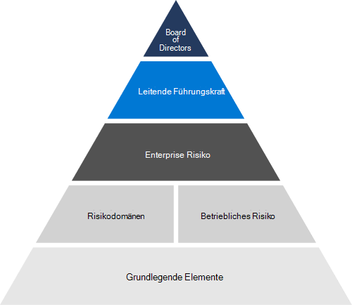

# Risikomanagement (Übersicht)Risk management overview

## Wie bewertet und verwaltet Microsoft Risiken im gesamten Unternehmen?How does Microsoft assess and manage risk across the enterprise?

Risikomanagement ist der Prozess zum Identifizieren und Bewerten von sowie zum Reagieren auf Risiken.Risk management is the process of identifying, assessing, and responding to risk. Das Risikomanagement bei Microsoft ist so konzipiert, dass es neue Bedrohungen antizipiert und kontinuierliche Sicherheit für unsere Cloudsysteme und die Kunden bietet, die diese nutzen.Risk management at Microsoft is designed to anticipate new threats and provide ongoing security for our cloud systems and the customers who use them.

Die Risikomanagementaktivitäten von Microsoft unterliegen dem Enterprise-Risikomanagementprogramm (ERM).Microsoft's risk management activities are governed by the Enterprise Risk Management (ERM) program. ERM ermöglicht den gesamten Enterprise-Risikomanagementprozess und arbeitet mit dem Management im gesamten Unternehmen zusammen, um die Verantwortlichkeit für die wichtigsten Risiken von Microsoft zu identifizieren und sicherzustellen.ERM enables the overall enterprise risk management process and works with management across the enterprise to identify and ensure accountability for Microsoft's most significant risks. Es konzentriert sich auf das Antizipieren, Bewerten und Melden von Risiken, um die Unternehmensstrategie von Microsoft zu informieren und die Risikominderung und Rechenschaftspflicht voranzutreiben.It focuses on anticipating, assessing, and reporting risks to inform Microsoft's business strategy and drive risk mitigation and accountability.

Microsoft ERM koordiniert die Aktivitäten des Risikomanagements im gesamten Unternehmen, damit Geschäftsbereiche konsistente und vergleichende Risikobewertungen unabhängig voneinander bereitstellen können.Microsoft ERM coordinates risk management activities across the enterprise to enable business units to independently facilitate consistent and comparative risk assessments. Diese Koordination ermöglicht Es Microsoft, Risikoinformationen für die Verwaltung konsolidiert zu aggregieren und zu melden.This coordination gives Microsoft the ability to aggregate and report risk information in a consolidated manner for management. ERM stellt Geschäftsbereichen bei Microsoft gemeinsame Methoden, Tools und Ziele für den Risikomanagementprozess bereit.ERM provides business units in Microsoft with common methodologies, tools, and goals for the risk management process. Microsoft 365 und andere Engineering-Gruppen und Geschäftseinheiten verwenden diese Tools, um individuelle Risikobewertungen im Rahmen ihrer eigenen Risikomanagementprogramme unter der Anleitung von ERM durchzuführen.Microsoft 365 and other engineering groups and business units use these tools to conduct individual risk assessments as part of their own risk management programs under the guidance of ERM.

## Wie funktioniert Microsoft 365 mit ERM?How does Microsoft 365 work with ERM?

Das Microsoft 365-Risikomanagementprogramm folgt dem ERM-Leitfaden zum Verwalten von Risiken über Microsoft 365 Dienste hinweg.The Microsoft 365 Risk Management program follows ERM guidance to manage risks across Microsoft 365 services. Der Schwerpunkt des Programms liegt auf der Ausrichtung des ERM-Frameworks an vorhandenen Microsoft 365 Engineering-, Service- und Complianceprozessen, wodurch das Risikomanagementprogramm effektiver und effizienter wird.The program focuses on aligning the ERM framework with existing Microsoft 365 engineering, service operations, and compliance processes, making the Risk Management program more effective and efficient. Microsoft 365 Risikomanagementaktivitäten werden letztendlich in den ERM-Prozess aufgenommen und informiert.Microsoft 365's risk management activities ultimately roll up into and inform the ERM process.

Im Rahmen der Aktivitäten zur Risikobewertung analysiert das Microsoft 365-Risikomanagementprogramm den Entwurf und die Betriebseffektivität von Steuerelementen, die als Teil des Microsoft 365 Controls Framework (Framework) implementiert sind.As part of risk assessment activities, the Microsoft 365 Risk Management program analyzes design and operating effectiveness of controls implemented as part of the Microsoft 365 Controls Framework (Framework). Das Framework ist ein rationalisierter Satz von Steuerelementen, mit dem Entwicklungsteams bei ordnungsgemäßer Implementierung und Unterstützung von Complianceaktivitäten wichtige Vorschriften und Zertifizierungen einhalten können.The Framework is a rationalized set of controls that, when properly implemented along with supporting compliance activities, allows engineering teams to comply with key regulations and certifications.

## Wie verwaltet und bewertet Microsoft 365 Risiken in den Onlinediensten?How does Microsoft 365 manage and assess risk in its online services?

Im Rahmen der laufenden Aktivitäten zur Risikobewertung führt das Microsoft 365-Risikomanagement-Programm Interviews mit den Serviceteams durch, die Microsoft 365 Dienste entwerfen, erstellen und betreiben, um aktuelle Risiken und Bereiche zu identifizieren.As part of ongoing risk assessment activities, the Microsoft 365 Risk Management program conducts interviews with the service teams that design, build, and operate Microsoft 365 services to identify current risks and areas of concern. Diese Aktivitäten werden zusammen mit der Analyse kontinuierlicher Überwachungsdaten, Audits und anderer Quellen verwendet, um Risikobewertungsberichte zu entwickeln, die aktuelle und mögliche zukünftige Risiken für langfristige Geschäftsziele identifizieren.These activities, along with analysis of continuous monitoring data, audits, and other sources, are used to develop risk assessment reports that identify current and possible future risks to long-term business goals. Berichte zur Risikobewertung bieten eine allgemeine Übersicht über den Risikostatus Microsoft 365 basierend auf unseren Ergebnissen und feedback von Microsoft 365 Serviceteams.Risk assessment reports provide a high-level overview of Microsoft 365's risk posture based on our findings and feedback from Microsoft 365 service teams. Zusammen mit ähnlichen Berichten aus anderen Geschäftsbereichen tragen Microsoft 365-Risikobewertungsberichte zu Risikobewertungen des ERM-Programms bei und liefern diesem entsprechende Daten.Together with similar reports from other business units, Microsoft 365 risk assessment reports contribute to and inform ERM program risk assessments.

Microsoft 365 Vertrauensstellung ist eine Gruppe, die für die Unterstützung von Sicherungsvorgängen im Zusammenhang mit Richtlinienkonformität, Sicherheitsanforderungen und Risikomanagement verantwortlich ist.Microsoft 365 Trust is a group responsible for supporting assurance operations related to policy compliance, security requirements, and risk management. Microsoft 365 Trust identifiziert neue Risiken, sobald sie entstehen, und überwacht bekannte Risiken und Reaktionen auf Risiken.Microsoft 365 Trust works to identify new risks as they emerge and monitor known risks and risk responses. Feedback von Microsoft 365 Serviceteams und kontinuierliche Überwachungsdaten aus Microsoft 365 Umgebungen informieren diesen Prozess.Feedback from Microsoft 365 service teams and continuous monitoring data from Microsoft 365 environments inform this process. Erfolg und Misserfolg von Risikoreaktionen werden verfolgt, um Analysen der Risikowahrscheinlichkeiten und -auswirkungen zu entwickeln und mit Daten zu versorgen.The success and failure of risk responses are tracked to develop and inform analysis of risk likelihoods and impacts. Regelmäßige Besprechungen zur Risikoüberprüfung mit Risikobesitzern ermöglichen Microsoft 365 Trust, Risikoreaktionen zu aktualisieren und zu verwalten.Regular risk review meetings with risk owners enable Microsoft 365 Trust to update and manage risk responses.

## Verwandte externe Vorschriften & ZertifizierungenRelated external regulations & certifications

Die Onlinedienste von Microsoft werden regelmäßig auf die Einhaltung externer Vorschriften und Zertifizierungen überprüft.Microsoft's online services are regularly audited for compliance with external regulations and certifications. Die Validierung von Steuerelementen im Zusammenhang mit dem Risikomanagement finden Sie in der folgenden Tabelle.Refer to the following table for validation of controls related to risk management.

| **Externe Überwachungen****External audits** | **Section****Section** | **Aktuelles Berichtsdatum****Latest report date** |
|:--------------------|:------------|:-----------------------|
| [FedRAMP (Office 365)FedRAMP (Office 365)](https://compliance.microsoft.com/compliancemanager) | Ca-2: SicherheitsbewertungenCA-2: Security assessments   CA-5: Aktionsplan und MeilensteineCA-5: Plan of action and milestones   RA-3: RisikobewertungRA-3: Risk assessment | 24. September 2020September 24, 2020 |
| [ISO 27001/27002 (Office 365)ISO 27001/27002 (Office 365)](https://servicetrust.microsoft.com/ViewPage/MSComplianceGuideV3?command=Download&downloadType=Document&downloadId=8d625374-4f2d-49f8-9d37-a4281ba98222&tab=7027ead0-3d6b-11e9-b9e1-290b1eb4cdeb&docTab=7027ead0-3d6b-11e9-b9e1-290b1eb4cdeb_ISO_Reports)    [Erklärung zur AnwendbarkeitStatement of Applicability](https://servicetrust.microsoft.com/ViewPage/MSComplianceGuideV3?command=Download&downloadType=Document&downloadId=c0df4ce8-c77e-4183-84eb-c8688470d8b1&tab=7027ead0-3d6b-11e9-b9e1-290b1eb4cdeb&docTab=7027ead0-3d6b-11e9-b9e1-290b1eb4cdeb_ISO_Reports)   [ZertifizierungCertification](https://servicetrust.microsoft.com/ViewPage/MSComplianceGuideV3?command=Download&downloadType=Document&downloadId=1e84a14a-2468-45ac-9412-5e53250d57ec&tab=7027ead0-3d6b-11e9-b9e1-290b1eb4cdeb&docTab=7027ead0-3d6b-11e9-b9e1-290b1eb4cdeb_ISO_Reports) | A.5: InformationssicherheitsrichtlinienA.5: Information security policies | 20. April 2021April 20, 2021 |
| [ISO 27017 (Office 365)ISO 27017 (Office 365)](https://servicetrust.microsoft.com/ViewPage/MSComplianceGuideV3?command=Download&downloadType=Document&downloadId=8d625374-4f2d-49f8-9d37-a4281ba98222&tab=7027ead0-3d6b-11e9-b9e1-290b1eb4cdeb&docTab=7027ead0-3d6b-11e9-b9e1-290b1eb4cdeb_ISO_Reports)    [Erklärung zur AnwendbarkeitStatement of Applicability](https://servicetrust.microsoft.com/ViewPage/MSComplianceGuideV3?command=Download&downloadType=Document&downloadId=c0df4ce8-c77e-4183-84eb-c8688470d8b1&tab=7027ead0-3d6b-11e9-b9e1-290b1eb4cdeb&docTab=7027ead0-3d6b-11e9-b9e1-290b1eb4cdeb_ISO_Reports)   [ZertifizierungCertification](https://servicetrust.microsoft.com/ViewPage/MSComplianceGuideV3?command=Download&downloadType=Document&downloadId=70de0999-5451-43a3-9ef4-761e8fbfb1a3&tab=7027ead0-3d6b-11e9-b9e1-290b1eb4cdeb&docTab=7027ead0-3d6b-11e9-b9e1-290b1eb4cdeb_ISO_Reports) | A.5: InformationssicherheitsrichtlinienA.5: Information security policies | 20. April 2021April 20, 2021 |
| [SOC 1 (Office 365)SOC 1 (Office 365)](https://servicetrust.microsoft.com/ViewPage/MSComplianceGuideV3?command=Download&downloadType=Document&downloadId=90df3f9c-3aaf-4dbf-99d0-ca9f2991721b&tab=7027ead0-3d6b-11e9-b9e1-290b1eb4cdeb&docTab=7027ead0-3d6b-11e9-b9e1-290b1eb4cdeb_SOC_%2F_SSAE_16_Reports) | CA-03: RisikomanagementCA-03: Risk management | 24. Dezember 2020December 24, 2020 |
| [SOC 2 (Office 365)SOC 2 (Office 365)](https://servicetrust.microsoft.com/ViewPage/MSComplianceGuideV3?command=Download&downloadType=Document&downloadId=a73c1738-7892-42b7-acd3-87b6371c53f6&tab=7027ead0-3d6b-11e9-b9e1-290b1eb4cdeb&docTab=7027ead0-3d6b-11e9-b9e1-290b1eb4cdeb_SOC_%2F_SSAE_16_Reports) | CA-02: Verantwortlichkeiten des Governance-, Risiko- und ComplianceteamsCA-02: Governance, risk, and compliance team responsibilities   CA-03: RisikomanagementCA-03: Risk management   CA-17: Microsoft-SicherheitsrichtlinieCA-17: Microsoft security policy   CA-24: Interne RisikobewertungCA-24: Internal risk assessment | 24. Dezember 2020December 24, 2020 |
