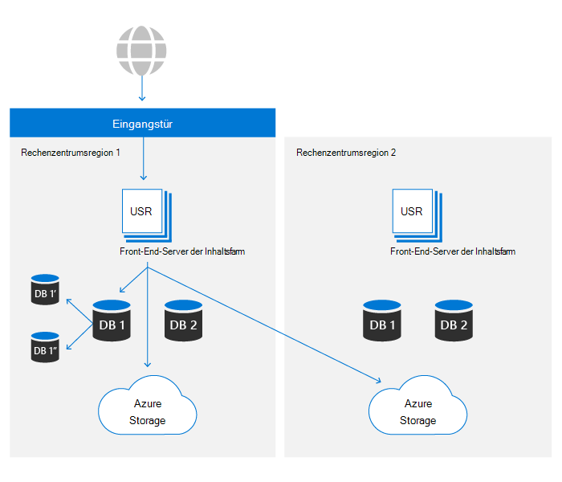
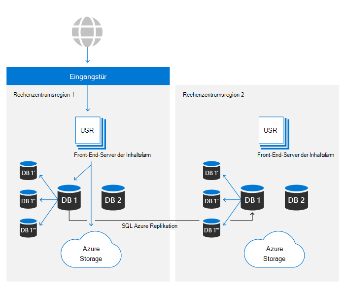

# SharePoint- und OneDrive-Datenresilienz in Microsoft 365

Innerhalb Microsoft 365 basiert OneDrive auf der SharePoint Dateiplattform. In diesem Artikel werden nur SharePoint verwendet, um auf beide Produkte zu verweisen. Der Inhalt dieses Artikels ist für Microsoft 365 relevant und gilt nicht für Verbraucherdienste.

Es gibt zwei primäre Ressourcen, die den zentralen Inhaltsspeicher von SharePoint bilden:

- **Metadaten:** Metadaten zu jeder Datei werden in Azure SQL-Datenbank gespeichert. Azure SQL bietet eine vollständige Geschäftskontinuität, die SharePoint verwendet und details weiter unten in diesem Artikel behandelt werden.
- **Blobspeicher:** Benutzerinhalte, die in SharePoint hochgeladen werden, werden in Azure Storage gespeichert. SharePoint hat auf Azure Storage einen benutzerdefinierten Resilienzplan erstellt, um eine nahezu in Echtzeit duplizierte Duplizierung von Benutzerinhalten und ein wirklich aktives/aktives System sicherzustellen.

Der vollständige Satz von Steuerelementen zur Gewährleistung der Datenresilienz wird in weiteren Abschnitten erläutert.

## Blobspeicherresilienz

SharePoint verfügt über eine benutzerdefinierte Lösung zum Speichern von Kundendaten in Azure Storage. Jede Datei wird gleichzeitig in eine primäre und eine sekundäre Rechenzentrumsregion geschrieben. Wenn Schreibvorgänge in eine der Azure-Regionen fehlschlagen, schlägt das Speichern der Datei fehl. Nachdem der Inhalt in Azure Storage geschrieben wurde, werden Prüfsummen separat mit Metadaten gespeichert und verwendet, um sicherzustellen, dass der zugesicherte Schreibvorgang mit der ursprünglichen Datei identisch ist, die während aller zukünftigen Lesevorgänge an SharePoint gesendet wird. Dieses Verfahren wird in allen Workflows verwendet, um die Weitergabe von Beschädigungen zu verhindern, die auftreten sollten. Innerhalb jeder Region bietet Azure Lokal redundante Storage (LRS) ein hohes Maß an Zuverlässigkeit. Weitere Informationen finden Sie im Artikel [zu Azure Storage Redundanz.](/azure/storage/common/storage-redundancy-lrs)

SharePoint verwendet Append-Only Speicher. Dadurch wird sichergestellt, dass Dateien nach einem anfänglichen Speichern nicht geändert oder beschädigt werden können, aber auch mithilfe der produktinternen Versionsverwaltung können alle früheren Versionen des Dateiinhalts abgerufen werden.

SharePoint Umgebungen in beiden Rechenzentren können auf Speichercontainer in beiden Azure-Regionen zugreifen. Aus Leistungsgründen wird der Speichercontainer im selben lokalen Rechenzentrum immer bevorzugt. Leseanforderungen, bei denen keine Ergebnisse innerhalb eines gewünschten Schwellenwerts angezeigt werden, weisen jedoch denselben Vom Remote-Rechenzentrum angeforderten Inhalt auf, um sicherzustellen, dass Daten immer verfügbar sind.

## Metadatenresilienz

SharePoint Metadaten sind auch für den Zugriff auf Benutzerinhalte wichtig, da sie den Speicherort der in Azure Storage gespeicherten Inhalte und zugriffstasten für diese speichern. Diese Datenbanken werden in Azure SQL gespeichert, das über einen umfassenden [Geschäftskontinuitätsplan verfügt.](/azure/sql-database/sql-database-business-continuity)

SharePoint verwendet das von Azure SQL bereitgestellte Replikationsmodell und hat eine proprietäre Automatisierungstechnologie entwickelt, um zu ermitteln, ob ein Failover erforderlich ist, und den Vorgang bei Bedarf zu initiieren. Daher fällt sie aus Sicht von Azure SQL in die Kategorie "Manuelles Datenbankfailover". Die neuesten Metriken für Azure SQL Datenbankwiederherstellung sind [hier](/azure/azure-sql/database/business-continuity-high-availability-disaster-recover-hadr-overview#recover-a-database-to-the-existing-server)verfügbar.

SharePoint verwendet das Sicherungssystem von Azure SQL, um Point-in-Time Restores (PITR) für bis zu 14 Tage zu aktivieren. PITR wird in einem [späteren Abschnitt](#deletion-backup-and-point-in-time-restore) ausführlicher behandelt.

## Automatisches Failover

SharePoint verwendet ein benutzerdefiniertes automatisiertes Failover, um die Auswirkungen auf die Kundenfreundlichkeit zu minimieren, wenn ein standortspezifisches Ereignis auftritt. Die überwachungsgesteuerte Automatisierung, bei der ein Einzelner oder ein Mehrkomponentenfehler über bestimmte Schwellenwerte hinaus erkannt wird, führt zu einer automatischen Umleitung aller Benutzeraktivitäten aus der problematischen Umgebung und zu einer warm sekundären Umgebung. Ein Failover führt dazu, dass Metadaten und Computespeicher vollständig außerhalb des neuen Rechenzentrums bereitgestellt werden. Da blob storage immer vollständig aktiv/aktiv ausgeführt wird, ist für ein Failover keine Änderung erforderlich. Die Computeebene bevorzugt den nächstgelegenen Blobcontainer, verwendet jedoch jederzeit sowohl lokale als auch Remote-Blobspeicherorte, um die Verfügbarkeit sicherzustellen.

SharePoint verwendet den Azure Front Door-Dienst, um das routinginterne Routing für das Microsoft-Netzwerk bereitzustellen. Diese Konfiguration ermöglicht eine dnsunabhängige Failoverumleitung und reduziert die Auswirkungen des Zwischenspeicherns auf lokale Computer. Die meisten Failovervorgänge sind für Endbenutzer transparent. Wenn ein Failover vorhanden ist, müssen Kunden keine Änderungen vornehmen, um den Zugriff auf den Dienst aufrechtzuerhalten.

## Versionsverwaltung und Dateiwiederherstellung

Bei neu erstellten Dokumentbibliotheken beträgt SharePoint standardmäßig 500 Versionen für jede Datei und kann so konfiguriert werden, dass bei Bedarf weitere Versionen beibehalten werden. Die Benutzeroberfläche lässt nicht zu, dass ein Wert von weniger als 100 Versionen festgelegt wird, aber es ist möglich, das System so festzulegen, dass weniger Versionen mit öffentlichen APIs gespeichert werden. Aus Gründen der Zuverlässigkeit wird jeder Wert unter 100 nicht empfohlen und kann zu Benutzeraktivitäten führen, die zu versehentlichem Datenverlust führen.

Weitere Informationen zur Versionsverwaltung finden Sie [unter Versionsverwaltung in SharePoint.](/microsoft-365/community/versioning-basics-best-practices)

Die Dateiwiederherstellung ist die Möglichkeit, in jeder Dokumentbibliothek in SharePoint zu einer beliebigen Sekunde in den letzten 30 Tagen "zurück in die Zeit" zu wechseln. Dieser Prozess kann verwendet werden, um von Ransomware, Massenlöschungen, Beschädigungen oder anderen Ereignissen wiederherzustellen. Dieses Feature verwendet Dateiversionen, damit die Reduzierung der Standardversionen die Effektivität dieser Wiederherstellung verringern kann.

Die Dateiwiederherstellungsfunktion ist sowohl für [OneDrive](https://support.office.com/article/restore-your-onedrive-fa231298-759d-41cf-bcd0-25ac53eb8a15) als auch [für SharePoint](https://support.office.com/article/Restore-a-document-library-317791c3-8bd0-4dfd-8254-3ca90883d39a)dokumentiert.

## Löschen, Sichern und Point-in-Time-Wiederherstellung

Aus SharePoint gelöschte Benutzerinhalte durchlaufen den folgenden Löschvorgang.

Gelöschte Elemente werden für einen bestimmten Zeitraum in Papierkorb aufbewahrt. Für SharePoint beträgt die Aufbewahrungszeit 93 Tage. Es beginnt, wenn Sie das Element von seinem ursprünglichen Speicherort löschen. Wenn Sie das Element aus dem Papierkorb der Website löschen, wird es in den Papierkorb der [Websitesammlung verschoben.](https://support.office.com/article/restore-deleted-items-from-the-site-collection-recycle-bin-5fa924ee-16d7-487b-9a0a-021b9062d14b) Es bleibt dort für den Rest der 93 Tage und wird dann endgültig gelöscht. Weitere Informationen zur Verwendung des Papierkorbs finden Sie unter den folgenden Links:

- [Wiederherstellen von Elementen im Papierkorb](https://support.office.com/article/Restore-items-in-the-Recycle-Bin-of-a-SharePoint-site-6df466b6-55f2-4898-8d6e-c0dff851a0be)
- [Gelöschte Elemente aus dem Papierkorb der Websitesammlung wiederherstellen.](https://support.office.com/article/Restore-deleted-items-from-the-site-collection-recycle-bin-5fa924ee-16d7-487b-9a0a-021b9062d14b)

Dieser Prozess ist der Standardmäßige Löschvorgang und berücksichtigt keine Aufbewahrungsrichtlinien oder Bezeichnungen. Weitere Informationen finden Sie unter [Informationen zur Aufbewahrung für SharePoint und OneDrive.](/microsoft-365/compliance/retention-policies-sharepoint)

Nach Abschluss der 93-tägigen Wiederverwendungspipeline erfolgt der Löschvorgang unabhängig für Metadaten und für Blob-Storage. Metadaten werden sofort aus der Datenbank entfernt, wodurch der Inhalt unlesbar wird, es sei denn, die Metadaten werden aus der Sicherung wiederhergestellt. SharePoint verwaltet Sicherungen von Metadaten für 14 Tage. Diese Sicherungen werden lokal in nahezu Echtzeit durchgeführt und dann in redundanten Azure Storage Containern in einem 5-10-Minuten-Zeitplan an den Speicher übertragen, gemäß der [Dokumentation](/azure/sql-database/sql-database-automated-backups) zum Zeitpunkt dieser Veröffentlichung.

Beim Löschen von Blob-Storage-Inhalten verwendet SharePoint das Soft Delete-Feature für Azure Blob Storage, um sich vor versehentlichem oder böswilligem Löschen zu schützen. Bei Verwendung dieses Features haben wir insgesamt 14 Tage Zeit, um Inhalte wiederherzustellen, bevor sie endgültig gelöscht werden.

>[!Note]
>Während Microsoft-Anwendungen Inhalte für den Standardprozess an den Papierkorb senden, stellt SharePoint APIs bereit, die das Überspringen des Papierkorbs und das Erzwingen eines sofortigen Löschens ermöglichen. Überprüfen Sie Ihre Anwendungen, um sicherzustellen, dass dies nur erfolgt, wenn dies aus Compliancegründen erforderlich ist.

## Integritätsüberprüfungen

SharePoint verwendet verschiedene Methoden, um die Integrität von Blobs und Metadaten in allen Phasen des Datenlebenszyklus sicherzustellen:

- **In Metadaten gespeicherter Dateihash:** Der Hash der gesamten Datei wird mit Dateimetadaten gespeichert, um sicherzustellen, dass die Datenintegrität auf Dokumentebene während aller Vorgänge beibehalten wird.
- **In Metadaten gespeicherter Blobhash:** Jedes Blobelement speichert einen Hash des verschlüsselten Inhalts, um sich vor Beschädigungen im zugrunde liegenden Azure-Speicher zu schützen.
- **Datenintegritätsauftrag:** Alle 14 Tage wird jede Website auf Integrität überprüft, indem Elemente in der Datenbank aufgelistet und mit aufgelisteten Blobs im Azure-Speicher abgeglich werden. Der Auftrag meldet alle blob-Verweise fehlende Speicher-Blobs und kann diese Blobs bei Bedarf über das [Azure Storage Soft-Delete-Feature](/azure/storage/blobs/soft-delete-blob-overview) abrufen.
