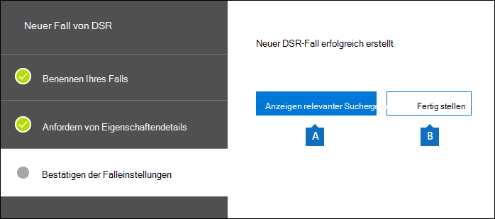
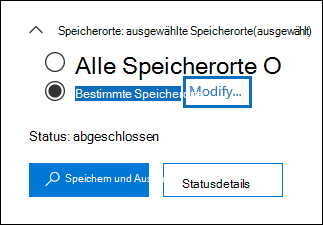
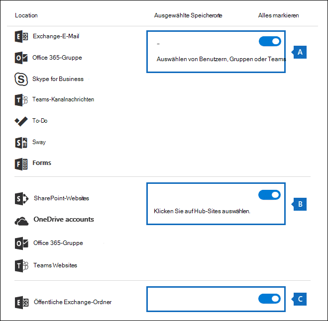
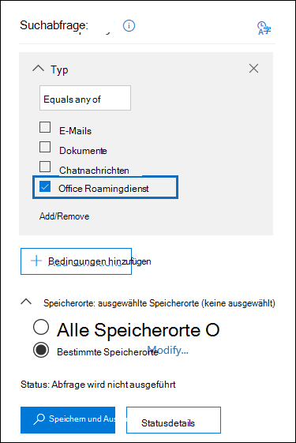

# <a name="manage-gdpr-data-subject-requests-with-the-dsr-case-tool-in-the-microsoft-365-compliance-center"></a>Verwalten von Anträgen betroffener Personen nach der DSGVO mit dem DSR-Falltool im Microsoft 365 Compliance Center

Die Datenschutz-Grundverordnung der EU (DSGVO) dient dem Schutz und der Stärkung der Datenschutzrechte des Einzelnen innerhalb der Europäischen Union (EU). Die DSGVO gibt Personen in der EU (in diesem Zusammenhang „betroffene Personen“ genannt) das Recht, auf ihre personenbezogenen Daten zuzugreifen, sie abzurufen, zu korrigieren, zu löschen und deren Verarbeitung einzuschränken. Als „personenbezogene Daten“ gelten gemäß DSGVO jegliche Informationen, die eine identifizierte oder identifizierbare natürliche Person betreffen. Ein formaler Antrag einer Person an ihre Organisation, bestimmte Maßnahmen im Zusammenhang mit ihren personenbezogenen Daten zu ergreifen, wird als „Antrag einer betroffenen Person“ (englisch Data Subject Request, DSR) bezeichnet. Ausführliche Informationen zum Beantworten von Anträgen betroffener Personen zu Daten in Office 365 finden Sie unter [Anträge betroffener Personen – Leitfaden für Office 365](https://go.microsoft.com/fwlink/?linkid=871169 ).
  
Um Untersuchungen als Reaktion auf einen DSR (Antrag einer betroffenen Person) zu verwalten, der von einer Person in Ihrer Organisation eingereicht wurde, können Sie das DSR-Falltool im Compliance Center verwenden, um Inhalte zu finden, die an folgenden Orten gespeichert sind:
  
- Benutzerpostfächer in Ihrer Organisation. Dies schließt Skype for Business-Unterhaltungen und Einzelchats in Microsoft Teams ein.

- Alle einer Microsoft 365-Gruppe zugeordneten Postfächer und alle Teampostfächer in Microsoft Teams

- Alle SharePoint Online-Sites und OneDrive for Business-Konten in Ihrer Organisation

- Alle Microsoft Teams-Sites und Microsoft 365-Gruppensites in Ihrer Organisation

- Alle öffentlichen Ordner in Exchange Online

Mit dem DSR-Falltool können Sie Folgendes tun:
  
- Einen separaten Fall für jede Untersuchung eines Antrags einer betroffenen Person erstellen.

- Kontrollieren, wer Zugriff auf den DSR-Fall hat, indem Sie Personen als Mitglieder des Falls hinzufügen. Nur Mitglieder können auf den Fall zugreifen, und diese Mitglieder können nur ihre eigenen Fälle in der Liste der Fälle auf der Seite der **DSR-Fälle** im Compliance Center sehen. Darüber hinaus können Sie verschiedenen Mitgliedern desselben Falls unterschiedliche Berechtigungen zuweisen. Beispielsweise können Sie festlegen, dass einige Mitglieder nur den Fall und Suchergebnisse einsehen können, und dass andere Mitglieder Suchabfragen erstellen und Suchergebnisse exportieren können.

- Die integrierte Suchfunktion verwenden, um nach allen Inhalten zu suchen, die von einer bestimmten betroffenen Person erstellt oder hochgeladen wurden.

- Optional die standardmäßige integrierte Suchabfrage überarbeiten und eine Suche erneut ausführen, um die Suchergebnisse einzugrenzen.

- Weitere Inhaltssuchen hinzufügen, die dem Fall zugeordnet sind. Dies schließt das Erstellen von Suchen ein, die teilweise indizierte Elemente und vom System generierte Protokolle vom Office-Roamingdienst zurückgeben.

- Daten für die Reaktion auf eine Zugriffs- oder Exportanfrage einer betroffenen Person exportieren.

- Fälle löschen, nachdem die Untersuchung des Antrags einer betroffenen Person abgeschlossen wurde. Dadurch werden alle Suchen und Exportaufgaben entfernt, die mit dem Fall verbunden sind.

Hier eine Übersicht über den Ablauf bei Verwendung des DSR-Falltools zum Verwalten der Untersuchung von Anträgen betroffener Personen:
  
[Schritt 1: Zuweisen von eDiscovery-Berechtigungen für potenzielle Fallbeteiligte](#step-1-assign-ediscovery-permissions-to-potential-case-members)

[Schritt 2: Erstellen eines neuen DSR-Falls und Hinzufügen von Mitgliedern](#step-2-create-a-dsr-case-and-add-members)

[Schritt 3: Ausführen der Suchabfrage](#step-3-run-the-search-query)

[Schritt 4: Exportieren der Daten](#step-4-export-the-data)

[(Optional) Schritt 5: Überarbeiten der integrierten Suchabfrage](#optional-step-5-revise-the-built-in-search-query)

[Weitere Informationen zur Verwendung des DSR-Falltools](#more-information-about-using-the-dsr-case-tool)
  
> [!IMPORTANT]
> Unsere Tools können Administratoren dabei helfen, Zugriffs- oder Exportanfragen betroffener Personen zu erfüllen, indem sie die integrierten Such- und Exportfunktionen nutzen, die im DSR-Falltool enthalten sind. Das Tool unterstützt Sie bei der Ermöglichung einer Best-Effort-Methode zum Exportieren von Daten, die für eine Anfrage einer betroffenen Person relevant sind. Es ist jedoch wichtig zu beachten, dass Suchergebnisse je nach betroffener Person oder den vom Administrator durchgeführten Aktionen variieren können. Dies kann sich darauf auswirken, ob ein Element als "personenbezogene Daten" zu Exportzwecken eingestuft wird oder nicht. Wenn die betroffene Person beispielsweise die letzte Person war, die eine nicht selbst erstellte Datei geändert hat, wird diese Datei u. U. nicht in den Suchergebnissen zurückgegeben. Ebenso könnte ein Administrator Daten exportieren, ohne teilweise indizierte Elemente oder alle Versionen von SharePoint-Dokumenten einzuschließen. Daher können die bereitgestellten Tools den Zugriff auf und das Exportieren von Daten zwar vereinfachen, die Ergebnisse hängen jedoch von bestimmten Nutzungsszenarien im Hinblick auf Administratoren und betroffene Personen ab.
  
## <a name="step-1-assign-ediscovery-permissions-to-potential-case-members"></a>Schritt 1: Potenziellen Fallmitgliedern eDiscovery-Berechtigungen zuweisen

Standardmäßig kann ein globaler Administrator im Microsoft 365 Compliance Center auf das DSR-Falltool zugreifen. Normalerweise haben andere Benutzer, z. B. ein Datenschutzbeauftragter, ein Personalmanager oder andere an DSR-Untersuchungen beteiligte Personen, keinen Zugriff auf das DSR-Falltool. Hierfür müssen ihnen zuerst die entsprechenden Berechtigungen zugewiesen werden. Am einfachsten geht das, indem Sie im Compliance Center auf die Seite **Berechtigungen** gehen, und Benutzer zur Rollengruppe „eDiscovery-Manager“ hinzufügen. Sie müssen ihnen außerdem diese Berechtigungen zuweisen, damit Sie sie als Mitglieder des in Schritt 2 zu erstellenden DSR-Falls hinzufügen können. 
  
Eine schrittweise Anleitung finden Sie unter [Zuweisen von eDiscovery-Berechtigungen](/microsoft-365/compliance/assign-ediscovery-permissions).
  
> [!NOTE]
> Standardmäßig verfügt ein globaler Administrator (oder andere Mitglieder der Rollengruppe „Organisationsverwaltung“ im Compliance Center) nicht über die erforderlichen Berechtigungen zum Exportieren der Ergebnisse von Inhaltssuchen (siehe Schritt 4 in diesem Artikel). Ein Administrator kann dies ändern, indem er sich selbst als Mitglied der Rollengruppe "eDiscovery-Manager" hinzufügt. 
  
## <a name="step-2-create-a-dsr-case-and-add-members"></a>Schritt 2: Erstellen eines DSR-Falls und Hinzufügen von Mitgliedern

Im nächsten Schritt erstellen wir einen DSR-Fall (Fall für einen Antrag einer betroffenen Person). Bei der Erstellung eines Falls können Sie die integrierte Suche starten oder den Fall erstellen, ohne die Suche zu starten. Im Folgenden wird erläutert, wie ein Fall erstellt wird, ohne die Suche zu starten, und anschließend, wie dem Fall Mitglieder hinzugefügt werden.
  
1. Wechseln Sie zu <https://compliance.microsoft.com>, und melden Sie sich mit Ihrem Geschäfts-, Schul- oder Unikonto an.

2. Klicken Sie im linken Bereich des Microsoft 365 Compliance Center auf **Anträge betroffener Personen**.

3. Klicken Sie auf der Seite **Anträge betroffener Personen** auf **Fall erstellen**.

4. Geben Sie auf der Assistentenseite **Neuer DSR-Fall** einen Namen für den Fall und eine optionale Beschreibung ein, und klicken Sie dann auf **Weiter**. Der Name des Falls darf in der Organisation nur einmalig vorkommen.

    > [!TIP]
    > Fügen Sie eventuell im Namen bzw. in der Beschreibung des neuen zu untersuchenden Falls den Namen der Person hinzu, die den DSR-Antrag eingereicht hat. Beachten Sie, dass nur Mitglieder dieses Falls (und eDiscovery-Administratoren) diesen in der Liste der Fälle auf der Seite der **Anträge betroffener Personen** sehen können.
  
5. Wählen Sie auf der Seite **Antragsdetails** unter **Betroffene Person** (die Person, die diesen Antrag eingereicht hat) die Person aus, deren Daten Sie suchen und exportieren möchten, und klicken Sie dann auf **Weiter**.

6. Auf der Seite **Falleinstellungen** können Sie den Namen und die Beschreibung des Falls ändern und eine andere betroffene Person auswählen. Klicken Sie andernfalls auf **Speichern**.

    Es wird eine Seite mit der Bestätigung angezeigt, dass der neue Fall für einen Antrag einer betroffenen Person erstellt wurde.

    
  
    An dieser Stelle können Sie zwischen zwei Aktionen wählen:

    a. Durch Klicken auf **Suchergebnisse anzeigen** wird die Suche gestartet. Dies ist die Standardauswahl. Die integrierte Suche, die bei Auswahl dieser Option ausgeführt wird, und die zurückgegebenen Ergebnisse werden in Schritt 3 erläutert.

    b. Wenn Sie auf **Fertigstellen** klicken, wird der neue DSR-Fall geschlossen, ohne die integrierte Suche zu starten. Wenn Sie diese Option auswählen, wird der neue DSR-Fall auf der Seite **Anträge betroffener Personen** angezeigt.

7. Klicken Sie auf **Fertigstellen**, um zum neuen DSR-Fall wechseln und ihm Mitglieder hinzufügen zu können.

8. Klicken Sie auf der Seite **Anträge betroffener Personen** auf den Namen des vorhin erstellten DSR-Falls.

9. Klicken Sie auf der Flyoutseite **Fall verwalten** unter **Mitglieder verwalten** auf **Hinzufügen**.

    Unter **Benutzer** wird eine Liste der Personen angezeigt, denen die entsprechenden eDiscovery-Berechtigungen zugewiesen wurden. Hier werden die Personen, denen Sie in Schritt 1 eDiscovery-Berechtigungen zugewiesen haben, angezeigt.

10. Wählen Sie die Personen aus, die sie als Mitglieder des DSR-Falls hinzufügen möchten, klicken Sie auf **Hinzufügen**, und speichern Sie dann Ihre Änderungen.

    Sie können auch Rollengruppen als Mitglieder des DSR-Falls hinzufügen, indem Sie unter **Rollengruppen hinzufügen** auf **Hinzufügen** klicken. 

## <a name="step-3-run-the-search-query"></a>Schritt 3: Ausführen der Suchabfrage

Nachdem Sie einen DSR-Fall erstellt und Mitglieder hinzugefügt haben, besteht der nächste Schritt in der Ausführung der integrierten Suche, die dem Fall zugeordnet ist. Diese Standardsuchabfrage führt Folgendes aus:
  
- Alle Postfächer in Ihrer Organisation werden nach allen E-Mail-Elementen durchsucht, die die Person gesendet oder erhalten hat. Hierzu wird die E-Mail-Eigenschaft *Participants*  verwendet, über die in allen Personenfeldern in einer E-Mail-Nachricht nach der betroffenen Person gesucht wird. Diese Eigenschaft gibt Elemente zurück, bei denen die betroffene Person in den Feldern **Von**, **An**, **CC** und **BCC** gefunden wurde. Öffentliche Ordner in Exchange Online werden ebenfalls nach Nachrichten durchsucht, die von der betroffenen Person gesendet oder empfangen wurden.

- Alle Sites in Ihrer Organisation werden nach Dokumenten und Elementen durchsucht, die von der betroffenen Person erstellt oder hochgeladen wurden. Dazu werden die folgenden Websiteeigenschaften verwendet:

  - Die  *Author*-Eigenschaft gibt Elemente zurück, bei denen die betroffene Person im Feld "Autor" in Office-Dokumenten  aufgeführt ist. Dieser Wert bleibt erhalten, selbst wenn das Dokument von einer anderen Person kopiert und hochgeladen wurde.

  - Die  *CreatedBy*-Eigenschaft  gibt Elemente zurück, die von der betroffenen Person erstellt oder hochgeladen wurden.

So sieht die Stichwortabfrage für die integrierte Suche aus, die automatisch erstellt wird, wenn Sie einen DSR-Fall erstellen:
  
```powershell
participants:"<email address>" OR author:"<display name>" OR createdby:"<display name>"
```

Wenn die betroffene Person beispielsweise "Ina Leonte" heißt, würde die Stichwortabfrage folgendermaßen aussehen:
  
```powershell
participants:"ina@contoso.com" OR author:"Ina Leonte" OR createdby:"Ina Leonte"
```

 **So führen Sie die integrierte Suche für einen DSR-Fall aus:**
  
1. Klicken Sie im Microsoft 365 Compliance Center auf **Anträge betroffener Personen**, wählen Sie den Fall aus, den Sie in Schritt 2 erstellt haben, und klicken Sie dann auf **Fall öffnen**.

2. Wählen Sie oben auf der Seite die Registerkarte **Suchen** aus, und aktivieren Sie das Kontrollkästchen neben der integrierten Suche, die beim Erstellen des DSR-Falls erstellt wurde. Die Suche hat den gleichen Namen wie der DSR-Fall. 

3. Klicken Sie in der Suche-Flyoutseite auf **Erneut ausführen**, um die Suche zu starten.

4. Wenn die Suche abgeschlossen ist, klicken Sie auf **Vorschau der Ergebnisse**, um eine Vorschau der Suchergebnisse anzuzeigen. Weitere Informationen finden Sie unter [Vorschau von Suchergebnissen anzeigen](/microsoft-365/compliance/content-search#preview-search-results).

    > [!TIP]
    > Sie können auch die Suchabfragestatistiken anzeigen, um die Anzahl der von der Suche zurückgegebenen Postfach- und Websiteelemente sowie die wichtigsten Inhaltsspeicherorte zu sehen, die Elemente enthalten, die der Suchabfrage entsprechen. Weitere Informationen finden Sie unter [Anzeigen von Informationen und Statistiken zu einer Suche](/microsoft-365/compliance/content-search#view-information-and-statistics-about-a-search). 
  
Sie können die integrierte Suchabfrage bearbeiten, die zu durchsuchenden Inhaltsspeicherorte ändern und die Suche dann erneut ausführen. Weitere Informationen finden Sie unter [Schritt 5](#optional-step-5-revise-the-built-in-search-query).
  
## <a name="step-4-export-the-data"></a>Schritt 4: Exportieren der Daten

Nachdem Sie die integrierte Suche ausgeführt haben, können Sie die Suchergebnisse exportieren. Alternativ können Sie die Abfrage vor dem Exportieren der Daten überarbeiten, um die Anzahl der Suchergebnisse zu verringern. Weitere Informationen zum Einschränken der Suchergebnisse finden Sie in Schritt 5.
  
Wenn Sie Suchergebnisse exportieren, können Postfachelemente in PST-Dateien oder als einzelne Nachrichten heruntergeladen werden. Wenn Sie Inhalte aus SharePoint- und OneDrive-Konten exportieren, werden Kopien von nativen Office-Dokumenten und anderen Dokumenten exportiert. Eine Ergebnisdatei mit Informationen zu jedem exportierten Element wird in die Suchergebnisse eingeschlossen. Ausführlichere Informationen zum Exportieren finden Sie unter [Exportieren von Ergebnissen einer Inhaltssuche](/microsoft-365/compliance/export-search-results).
  
> [!NOTE]
> Standardmäßig verfügt ein globaler Administrator (oder andere Mitglieder der Rollengruppe „Organisationsverwaltung“ im Compliance Center) nicht über die erforderlichen Berechtigungen zum Exportieren der Ergebnisse von Inhaltssuchen. Ein Administrator kann dies ändern, indem er sich selbst als Mitglied der Rollengruppe "eDiscovery-Manager" hinzufügt. 
  
Der Computer, den Sie für den Export von Daten verwenden, muss folgende Systemanforderungen erfüllen:
  
- 32- oder 64-Bit-Versionen von Windows 7 und höher
    
- Microsoft .NET Framework 4.7
    
- Unterstützter Browser:
    
  - Microsoft Edge
    
    Oder
    
  - Microsoft Internet Explorer 10 und höher
    
    > [!NOTE]
    > Microsoft fertigt keine Erweiterungen oder Add-Ons von Drittanbietern für ClickOnce-Anwendungen. Das Exportieren von Daten mithilfe eines nicht unterstützten Browsers mit Erweiterungen oder Add-Ons von Drittanbietern wird nicht unterstützt. 
  
 **So exportieren Sie Daten aus der integrierten Suche in einem DSR-Fall:**
  
1. Klicken Sie im Microsoft 365 Compliance Center auf **Anträge betroffener Personen**, wählen Sie den Fall aus, den Sie in Schritt 2 erstellt haben, und klicken Sie dann auf **Fall öffnen**.

2. Wählen Sie oben auf der Seite die Registerkarte **Suchen** aus, und aktivieren Sie das Kontrollkästchen neben der integrierten Suche, die beim Erstellen des DSR-Falls erstellt wurde.

3. Klicken Sie auf der Flyoutseite auf **Ergebnisse exportieren**. 

4. Wählen Sie auf der Seite **Ergebnisse exportieren** die folgenden empfohlenen Optionen für DSR-Exportanforderungen aus. 

    
  
    a. Wählen sie unter **Ausgabeoptionen** die erste Option aus (**Alle Elemente, mit Ausnahme solcher mit einem unbekannten Format, die verschlüsselt sind oder aus anderen Gründen nicht indiziert wurden**) aus, um nur indizierte Elemente zu exportieren. Der Grund, warum teilweise indizierte Elemente aus der integrierten Suche nicht exportiert werden sollen, liegt daran, dass teilweise indizierte Elemente anderer Benutzer ebenfalls exportiert würden. Wenn Sie nur die teilweise indizierten Elemente für eine betroffene Person exportieren möchten, empfiehlt es sich, eine separate Suche zu erstellen. Weitere Informationen finden Sie unter [Exportieren teilweise indizierter Elemente](#exporting-partially-indexed-items) im Abschnitt "Weitere Informationen zur Verwendung des DSR-Falltools".

    b. Wählen Sie unter **Exchange-Inhalte exportieren als** die dritte Option aus (**Eine PST-Datei, die alle Nachrichten in einem einzigen Ordner enthält**). Da einige der Ergebnisse möglicherweise Elemente betreffen, die aus dem Postfach eines anderen Benutzers stammen, wird ein Element bei dieser Option nur in einem einzigen Ordner ohne Angabe des tatsächlichen Postfachs aufgeführt. Dies ist die beste Option, wenn Sie die Ergebnisse wie im nächsten Punkt empfohlen deduplizieren. Bei Auswahl dieser Option kann eine betroffene Person Elemente in chronologischer Reihenfolge überprüfen (diese werden nach Sendedatum sortiert), ohne dass sie bei jedem Element durch die ursprüngliche Postfach-Ordnerstruktur navigieren muss.

    c. Wählen Sie die Option **Deduplizierung aktivieren** aus, um Duplikate von E-Mail-Nachrichten auszuschließen. Die Aktivierung dieser Option wird empfohlen, da mit der integrierten Suche alle Postfächer in Ihrer Organisation durchsucht werden. Wenn in den durchsuchten Postfächern mehrere Kopien derselben Nachricht gefunden werden, bewirkt diese Option, dass jeweils nur eine Kopie exportiert wird. Diese Option bietet zusammen mit dem Exportieren von Nachrichten in einer PST-Datei in einem einzigen Ordner die beste Benutzerfreundlichkeit bei DSR-Exportanforderungen. Im Exportbericht "Results.csv" werden alle Speicherorte aufgeführt, an denen Duplikate von Nachrichten gefunden wurden.

    Optional können Sie die Option **Versionen von SharePoint-Dokumenten einschließen**, um alle Versionen von SharePoint- und OneDrive-Dokumenten zu exportieren. Dies setzt voraus, dass die Versionsverwaltung für Dokumentbibliotheken aktiviert ist. Diese Option hilft Ihnen dabei, sicherzustellen, dass alle relevanten Daten exportiert werden.

5. Nachdem Sie die Exporteinstellungen festgelegt haben, klicken Sie auf **Exportieren**.

    Die Suchergebnisse werden zum Herunterladen vorbereitet, d. h., sie werden in den Azure Storage-Bereich Ihrer Organisation in der Microsoft-Cloud hochgeladen. In den nächsten Schritten wird gezeigt, wie Sie diese Daten auf den lokalen Computer herunterladen können.

6. Klicken Sie auf die Registerkarte **Exportieren**, um den von Ihnen erstellten Exportauftrag anzuzeigen. Exportaufträge haben den gleichen Namen wie die zugehörige Inhaltssuche, wobei **_Export** an das Ende des Suchnamens angefügt wird.

7. Klicken Sie auf den soeben erstellten Exportauftrag, um die Export-Flyoutseite anzuzeigen. Auf dieser Seite werden Informationen zur Suche angezeigt, z. B. die Größe und Gesamtanzahl der zu exportierenden Elemente sowie der Prozentsatz der Elemente, die in einen Azure Storage-Bereich übertragen wurden. Klicken Sie auf **Aktualisieren**, um die Informationen zum Uploadstatus zu aktualisieren. 

8. Klicken Sie unter **Exportschlüssel** auf **In die Zwischenablage kopieren**. Dieser Schlüssel wird zum Herunterladen der Suchergebnisse in Schritt 11 verwendet.

9. Klicken Sie oben auf der Export-Flyoutseite auf  **Ergebnisse herunterladen**. 

10. Klicken Sie im Popupfenster unten auf der Seite auf **Öffnen**, um das **eDiscovery-Exporttool** zu öffnen. Das **eDiscovery-Exporttool** wird beim ersten Herunterladen von Suchergebnissen installiert. 

11. Fügen Sie im **eDiscovery-Exporttool** den Exportschlüssel, den Sie in Schritt 8 kopiert haben, in das entsprechende Feld ein.

12. Klicken Sie auf **Durchsuchen**, um das Verzeichnis anzugeben, in das die Dateien mit den Suchergebnissen heruntergeladen werden sollen. 

    > [!NOTE]
    > Aufgrund der hohen Menge an Datenträgeraktivitäten (Lese- und Schreibvorgänge) sollten Sie Suchergebnisse auf eine lokale Festplatte herunterladen. Laden Sie sie nicht auf ein zugeordnetes Netzlaufwerk oder an einen anderen Netzwerkspeicherort herunter. 
  
13. Klicken Sie zum Herunterladen der Suchergebnisse auf Ihren Computer auf **Starten**. 

    Das **eDiscovery-Export-Tool** zeigt Statusinformationen zum Export an, z. B. die geschätzte Anzahl (und Größe) der verbleibenden herunterzuladenden Elemente. Nach Abschluss des Exportvorgangs können Sie in dem Verzeichnis auf die Dateien zugreifen, in das sie heruntergeladen wurden. Weitere Informationen zu den Berichten, die beim Herunterladen von Ergebnissen einer Inhaltssuche enthalten sind, finden Sie im Abschnitt [Weitere Informationen](/microsoft-365/compliance/export-search-results#more-information) unter "Exportieren der Ergebnisse von Inhaltssuchen". 

Nachdem die Daten exportiert wurden, befinden sich die Suchergebnisse und Exportberichte in einem Ordner mit dem gleichen Namen wie der DSR-Fall. Die PST-Dateien, die Postfachelemente enthalten, befinden sich in einem Unterordner namens **Exchange**. Dokumente und andere Elemente von Websites befinden sich in einem Unterordner namens **SharePoint**.
  
## <a name="optional-step-5-revise-the-built-in-search-query"></a>(Optional) Schritt 5: Überarbeiten der integrierten Suchabfrage

Nachdem Sie die integrierte Suche ausgeführt haben, können Sie sie überarbeiten, damit weniger Suchergebnisse zurückgegeben werden. Dazu können Sie der Abfrage Bedingungen hinzufügen. Eine Bedingung ist durch den Operator **AND** logisch mit der Stichwortabfrage verknüpft. Dies bedeutet, dass Elemente sowohl der Stichwortabfrage als auch den von Ihnen hinzugefügten Bedingungen entsprechen müssen, um in den Suchergebnissen zurückgegeben zu werden. Auf diese Weise können die Suchergebnisse mithilfe von Bedingungen weiter eingegrenzt werden. Wenn Sie zwei oder mehr eindeutige Bedingungen (Bedingungen, die unterschiedliche Eigenschaften angeben) zu einer Suchabfrage hinzufügen, werden diese Suchkriterien mit dem **AND**-Operator logisch verknüpft. Das bedeutet, dass nur Elemente zurückgegeben werden, die neben der Stichwortabfrage allen Bedingungen entsprechen. Wenn Sie mehrere Werte (durch Kommas oder Semikolons getrennt) zu einer Bedingung hinzufügen, werden diese Werte mit dem **OR**-Operator verknüpft. Das bedeutet, es werden Elemente zurückgegeben, die einen der angegebenen Werte für die Eigenschaft in der Bedingung enthalten.
  
Nachstehend sehen Sie einige Beispiele für die Bedingungen, die Sie der integrierten Suchabfrage eines DSR-Falls hinzufügen können. Der Eigenschaftenname, der tatsächlich in einer Suchabfrage verwendet wird, ist in Klammern angegeben.
  
- **Dateityp ( `filetype`)**: Gibt die Erweiterung eines Dokuments oder einer Datei an. Verwenden Sie diese Bedingung, um nach Dokumenten und Dateien zu suchen, die von bestimmten Office-Anwendungen wie Word, Excel und OneNote erstellt wurden. 

- **Nachrichtentyp ( `kind`)**: Gibt den Typ des E-Mail-Elements an, nach dem gesucht werden soll. Sie können z. B. die Syntax `kind:email OR kind:im` verwenden, damit nur E-Mail-Nachrichten und Skype for Business-Unterhaltungen oder Einzelchats in Microsoft Teams zurückgegeben werden.

- **Compliancetag (`compliancetag`)**: Gibt eine Bezeichnung an, die einer E-Mail-Nachricht oder einem Dokument zugewiesen ist. Diese Bedingung gibt Elemente zurück, die mit einer bestimmten Bezeichnung klassifiziert wurden. Bezeichnungen werden verwendet, um E-Mail-Nachrichten und Dokumente zwecks Datenkontrolle zu klassifizieren und auf der Grundlage der durch die Bezeichnung definierten Klassifikation Aufbewahrungsrichtlinien durchzusetzen. Dies ist eine nützliche Bedingung für Untersuchungen im Rahmen von Anträgen betroffener Personen, da Ihr Unternehmen möglicherweise Bezeichnungen verwendet, um Inhalte zu klassifizieren, die im Zusammenhang mit Datenschutz stehen, bzw. Inhalte, die personenbezogene Daten oder vertrauliche Informationen enthalten. Verwenden Sie als Wert für diese Bedingung den vollständigen Bezeichnungsnamen oder den ersten Teil des Bezeichnungsnamens mit einem Platzhalter. Weitere Informationen finden Sie unter [Informationen zu Aufbewahrungsrichtlinien und Aufbewahrungsbezeichnungen](/microsoft-365/compliance/retention).

Eine Liste und Beschreibung aller Bedingungen, die im DSR-Falltool verfügbar sind, finden Sie unter [Suchbedingungen](/microsoft-365/compliance/keyword-queries-and-search-conditions#search-conditions) im Artikel "Stichwortabfragen und Suchbedingungen für Inhaltssuchen". 
  
### <a name="changing-the-content-locations-that-are-searched"></a>Ändern der Inhaltsspeicherorte, die durchsucht werden sollen

Zusätzlich zur Überarbeitung der integrierten Suche für einen DSR-Fall können Sie auch ändern, welche Inhaltsspeicherorte durchsucht werden sollen. Wie zuvor erläutert, durchsucht die integrierte Suche jedes Postfach und jede Site in der Organisation sowie alle öffentlichen Exchange Online-Ordner. Sie können die Suche beispielsweise so eingrenzen, dass nur das Postfach und das OneDrive-Konto der betroffenen Person sowie bestimmte SharePoint-Sites durchsucht werden. Wenn bestimmte Sites durchsucht werden sollen, müssen Sie jede zu durchsuchende Site hinzufügen.
  
So ändern Sie die zu durchsuchenden Inhaltsspeicherorte:
  
1. Öffnen Sie die integrierte Suche, bei der Sie die Inhaltsspeicherorte ändern möchten.

2. Klicken Sie in der Suchabfrage unter **Speicherorte** neben **Bestimmte Speicherorte** auf **Ändern**. 

    
  
    Die Flyoutseite **Speicherorte ändern** wird angezeigt. Hier ist eine Beschreibung der Inhaltsspeicherorte in der integrierten Suche sowie einige Informationen zum Ändern der durchsuchten Speicherorte. 

    
  
    a. Der Umschalter unter **Alle auswählen** im Abschnitt "Postfach" oben auf der Flyoutseite ist aktiviert, was bedeutet, dass alle Postfächer durchsucht werden. Wenn Sie die Suche eingrenzen möchten, klicken Sie auf den Schalter, um die Auswahl aufzuheben, und dann auf **Benutzer, Gruppen oder Teams auswählen**, und wählen Sie bestimmte Postfächer aus, die durchsucht werden sollen.

    b. Der Umschalter unter **Alle auswählen** im Abschnitt "Sites" in der Mitte der Flyoutseite ist aktiviert, was bedeutet, dass alle Sites durchsucht werden. Um die Suche auf bestimmte Sites zu beschränken, deaktivieren Sie den Schalter, und klicken Sie dann auf **Sites auswählen**. Sie müssen jede Site hinzufügen, die durchsucht werden soll, einschließlich des OneDrive-Kontos der betroffenen Person.

    c. Der Umschalter im Abschnitt "Öffentliche Exchange-Ordner" ist aktiviert, was bedeutet, dass alle öffentlichen Exchange-Ordner durchsucht werden. Es können nur alle oder keiner der öffentlichen Exchange-Ordner durchsucht werden. Sie können nicht einzelne für die Suche auswählen.

3. Wenn Sie die Inhaltsspeicherorte in der integrierten Suche fertig überarbeitet haben, klicken Sie auf **Speichern &amp; ausführen**, um die Suche neu zu starten. 

> [!NOTE]
> Wenn Sie alle Postfach-Speicherorte oder nur bestimmte Postfächer durchsuchen, werden beim Exportieren der Ergebnisse der Suche auch Daten aus anderen Office 365-Anwendungen, die in Benutzerpostfächern gespeichert sind, einbezogen. Diese Daten werden nicht in die geschätzten Suchergebnisse einbezogen und sind für die Vorschau nicht verfügbar. Sie sind jedoch in den Suchergebnissen enthalten, wenn Sie diese exportieren und herunterladen. Weitere Informationen zu den Anwendungen, die Daten im Postfach eines Benutzers speichern, finden Sie unter [In Exchange Online-Postfächern gespeicherte Inhalte](/microsoft-365/compliance/what-is-stored-in-exo-mailbox).
  
## <a name="more-information-about-using-the-dsr-case-tool"></a>Weitere Informationen zur Verwendung des DSR-Falltools

Die folgenden Abschnitte enthalten weitere Informationen zur Verwendung des DSR-Falltools für Reaktionen auf Exportanträge betroffener Personen.
  
[Exportieren von Daten aus dem Office-Roamingdienst](#exporting-data-from-the-office-roaming-service)

[Exportieren teilweise indizierter Elemente](#exporting-partially-indexed-items)

[Suchen nach und Exportieren von Daten aus Microsoft Teams und Microsoft 365-Gruppen](#searching-and-exporting-data-from-microsoft-teams-and-microsoft-365-groups)

[Durchsuchen öffentlicher Exchange-Ordner](#searching-exchange-public-folders)
  
### <a name="exporting-data-from-the-office-roaming-service"></a>Exportieren von Daten aus dem Office-Roamingdienst

Sie können das DSR-Falltool verwenden, um nach Nutzungsdaten, die vom Office-Roamingdienst generiert wurden, zu suchen und diese zu exportieren. Roaming ist ein Dienst, der Office-bezogene Einstellungen speichert, z.B. Office-Design, Benutzerwörterbuch, Spracheinstellungen, Entwicklermodus und AutoKorrektur. 

Die Daten aus dem Office-Roamingdienst werden im Postfach einer betroffenen Person in einem ausgeblendeten Ordner gespeichert, der sich in einer Nicht-IPM-Unterstruktur (Non-Interpersonal Message) von Exchange Online-Postfächern befindet. Dies bedeutet, dass die Daten in der Ansicht eines Benutzers ausgeblendet sind, wenn er Outlook oder andere E-Mail-Clients für den Zugriff auf sein Postfach verwendet. Weitere Informationen zu ausgeblendeten Ordnern finden Sie unter [Ausgeblendete MAPI-Ordner](https://go.microsoft.com/fwlink/?linkid=872758).
  
Sie können eine separate Inhaltssuche erstellen (und diese einem DSR-Fall zuordnen), die die Nutzungsdaten des Office-Roamingdienstes im Postfach der betroffenen Person zurückgibt. Diese Daten werden nicht in die Suchstatistiken einbezogen und sind auch nicht für die Vorschau verfügbar. Sie können sie aber exportieren und sie im Rahmen der Reaktion auf einen Exportantrag einer betroffenen Person an diese übermitteln.
  
Wenn Sie Daten aus dem Office-Roamingdienst exportieren, werden diese in einem separaten Ordner im Ordner **ApplicationDataRoot** gespeichert, der sich wiederum in einem Ordner befindet, der mit der E-Mail-Adresse der betroffenen Person benannt ist. Diese Daten werden als JSON-Dateien exportiert. Dabei handelt es sich um für Menschen lesbare Textdateien, ähnlich wie XML- oder TXT-Dateien, die an E-Mail-Nachrichten angefügt werden. Dieser Ordner ist derzeit mit der GUID (Globally Unique Identifier) **1caee58f-eb14-4a6b-9339-1fe2ddf6692b** benannt. In zukünftigen Versionen des DSR-Fallstools wird die GUID durch den Namen der tatsächlichen Anwendung ersetzt. 

**So können Sie nach Daten des Office-Roamingdiensts suchen und diese exportieren**:
  
1. Klicken Sie im Microsoft 365 Compliance Center auf **Anträge betroffener Personen** und dann auf **Fall öffnen** neben dem DSR-Fall für die betroffene Person, für die Sie Nutzungsdaten exportieren möchten. 

2. Klicken Sie oben auf der Seite auf die Registerkarte **Suchen** und dann auf  **Geführte Suche**.

3. Klicken Sie auf der Seite **Namen der Suche** auf **Abbrechen**. 

4. Aktivieren Sie unter **Suchabfrage** in der Bedingung **Typ** das Kontrollkästchen neben **Office-Roamingdienst**. 

    
  
    Die **Typ**-Bedingung (die E-Mail-Nachrichtenklassen betrifft) sollte das einzige Element in der Suchabfrage sein. Sie können das Feld **Schlüsselwörter** löschen oder es leer lassen. 

5. Stellen Sie sicher, dass unter **Speicherorte** die Option **Bestimmte Speicherorte** aktiviert ist, und klicken Sie dann auf **Ändern**.

6. Klicken Sie im oberen Teil der Flyoutseite **Speicherorte** (Abschnitt "Postfach") auf **Benutzer, Gruppen oder Teams auswählen**.

7. Klicken Sie auf der Seite **Speicherorte bearbeiten** auf **Benutzer, Gruppen oder Teams auswählen**, wählen Sie das Postfach der betroffenen Person aus, und speichern Sie dann Ihre Auswahl. 

8. Klicken Sie auf **Speichern und ausführen**, geben Sie der Suche einen Namen, und speichern Sie sie.

    Die Suche wird gestartet.

 **So exportieren Sie Daten des Office-Roamingdiensts**:
  
1. Wenn die im vorherigen Schritt erstellte Suche abgeschlossen ist, klicken Sie oben auf der Seite auf die Registerkarte **Suchen** und dann auf das Kontrollkästchen neben der Suche. Möglicherweise müssen Sie auf  **Aktualisieren** klicken, um die Suche anzuzeigen.

2. Klicken Sie auf der Flyoutseite auf **Ergebnisse exportieren**.

3. Wählen Sie auf der Seite **Ergebnisse exportieren** die empfohlenen Optionen zum Exportieren von Nutzungsdaten aus. 

    
  
    a. Wählen sie unter **Ausgabeoptionen** die erste Option aus (**Alle Elemente, mit Ausnahme solcher mit einem unbekannten Format, die verschlüsselt sind oder aus anderen Gründen nicht indiziert wurden**) aus, um nur indizierte Elemente zu exportieren.

    b. Wählen Sie unter **Exchange-Inhalte exportieren als** die zweite Option aus (**Eine PST-Datei, die alle Nachrichten enthält**).

    c. Lassen Sie die restlichen Exportoptionen deaktiviert.

4. Nachdem Sie die Exporteinstellungen festgelegt haben, klicken Sie auf **Exportieren**.

    Die Suchergebnisse werden zum Herunterladen vorbereitet, d. h., sie werden in den Azure Storage-Bereich Ihrer Organisation in der Microsoft-Cloud hochgeladen. In den nächsten Schritten wird gezeigt, wie Sie diese Daten auf den lokalen Computer herunterladen können.

5. Klicken Sie auf die Registerkarte **Exportieren**, um den von Ihnen erstellten Exportauftrag anzuzeigen. Exportaufträge haben den gleichen Namen wie die zugehörige Inhaltssuche, wobei **_Export** an das Ende des Suchnamens angefügt wird. 

6. Klicken Sie auf den soeben erstellten Exportauftrag, um die Export-Flyoutseite anzuzeigen. 

7. Klicken Sie unter **Exportschlüssel** auf **In die Zwischenablage kopieren**. Dieser Schlüssel wird zum Herunterladen der Suchergebnisse in Schritt 10 verwendet.

8. Klicken Sie oben auf der Export-Flyoutseite auf  **Ergebnisse herunterladen**. 

9. Klicken Sie im Popupfenster unten auf der Seite auf **Öffnen**, um das **eDiscovery-Exporttool** zu öffnen. Das **eDiscovery-Exporttool** wird beim ersten Herunterladen von Suchergebnissen installiert. 

10. Fügen Sie im **eDiscovery-Exporttool** den Export-Schlüssel, den Sie in Schritt 7 kopiert haben, in das entsprechende Feld ein.

11. Klicken Sie auf **Durchsuchen**, um das Verzeichnis anzugeben, in das die Dateien mit den Suchergebnissen heruntergeladen werden sollen. 

    > [!NOTE]
    > Aufgrund der hohen Menge an Datenträgeraktivitäten (Lese- und Schreibvorgänge) sollten Sie Suchergebnisse auf eine lokale Festplatte herunterladen. Laden Sie sie nicht auf ein zugeordnetes Netzlaufwerk oder an einen anderen Netzwerkspeicherort herunter. 
  
12. Klicken Sie zum Herunterladen der Suchergebnisse auf Ihren Computer auf **Starten**. 

    Das **eDiscovery-Export-Tool** zeigt Statusinformationen zum Export an, z. B. die geschätzte Anzahl (und Größe) der verbleibenden herunterzuladenden Elemente. Nach Abschluss des Exportvorgangs können Sie die Exchange PST-Datei in Outlook öffnen und dann zum Ordner **ApplicationDataRoot** gehen, um auf den Unterordner für den Roamingdienst zuzugreifen. 

    Wie zuvor erläutert, werden die JSON-Dateien, die Nutzungsdaten enthalten, an Nachrichten angefügt. Klicken Sie zum Anzeigen einer JSON-Datei auf eine Nachricht, und öffnen Sie dann die angefügte JSON-Datei.
  
### <a name="exporting-partially-indexed-items"></a>Exportieren teilweise indizierter Elemente

Es wird davon abgeraten, teilweise indizierte Elemente (auch als nicht indizierte Elemente bezeichnet) aus der integrierten Suche, die beim Erstellen eines DSR-Falls erstellt wird, zu exportieren. Dies liegt daran, dass die Suchergebnisse höchstwahrscheinlich teilweise indizierte Elemente für andere Benutzer in Ihrer Organisation und nicht nur solche für die betroffene Person enthalten. Es empfiehlt sich, stattdessen eine separate, dem DSR-Fall zugeordnete Inhaltssuche zu erstellen, die nur die mit der betroffenen Person in Zusammenhang stehenden teilweise indizierten Elemente exportiert.
  
Hier ist ein allgemeiner Prozess zum Exportieren von teilweise indizierten Elementen. Nachdem die Elemente exportiert wurden, können Sie sie überprüfen, um festzustellen, ob eines für den Zugriff oder den Export infolge eines Antrag einer betroffenen Person infrage kommt.
  
1. Öffnen Sie den DSR-Fall, und erstellen Sie auf der Seite **Suchen** eine Suche.

2. Konfigurieren Sie die Suchabfrage und die zu durchsuchenden Inhaltsspeicherorte anhand der folgenden Kriterien:

    - Verwenden Sie eine leere/leere Stichwortabfrage. Dadurch werden alle Elemente an den durchsuchten Inhaltsspeicherorten zurückgegeben.

    - Durchsuchen Sie nur das Exchange Online-Postfach der betroffenen Person sowie ihr OneDrive-Konto.

3. Nachdem Sie die Suche ausgeführt haben und diese abgeschlossen wurde, können Sie die Suchergebnisse exportieren und herunterladen (wie in [Schritt 4](#step-4-export-the-data) beschrieben). Nehmen Sie die folgenden Einstellungen vor, um teilweise indizierte Elemente zu exportieren.

    - Wählen sie unter **Ausgabeoptionen** die dritte Option aus (**Nur Elemente, die ein unbekanntes Format aufweisen, die verschlüsselt sind oder aus anderen Gründen nicht indiziert wurden**) aus, um nur teilweise indizierte Elemente zu exportieren.

    - Unter **Exchange-Inhalte exportieren als** können Sie eine beliebige Option basierend auf Ihren Einstellungen auswählen.

    - Wenn Sie die Option **Versionen von SharePoint-Dokumenten einschließen** auswählen, werden teilweise indizierte Versionen von Dokumenten exportiert.

Weitere Informationen zu teilweise indizierten Elementen finden Sie unter:
  
- [Teilweise indizierte Elemente in der Inhaltssuche](/microsoft-365/compliance/partially-indexed-items-in-content-search)

- [Exportieren teilweise indizierter Elemente](/microsoft-365/compliance/export-search-results#exporting-partially-indexed-items)

### <a name="searching-and-exporting-data-from-microsoft-teams-and-microsoft-365-groups"></a>Suchen nach und Exportieren von Daten aus Microsoft Teams und Microsoft 365-Gruppen

Unterhaltungen, die Bestandteil der Chatliste in Microsoft Teams sind (sog. Teamchats oder Einzelchats), werden in den Exchange Online-Postfächern der Benutzer gespeichert, die am jeweiligen Chat teilnehmen. Darüber hinaus werden Dateien, die eine Person in einem Einzelchat teilt, in deren OneDrive-Konto gespeichert. Da die integrierte Suche alle Postfächer und OneDrive-Konten in der Organisation durchsucht, werden Teamchats und in einer Chatsitzung freigegebene Dokumente (die von der betroffenen Person erstellt oder hochgeladenen wurden) von der integrierten Suche in einem DSR-Fall zurückgegeben.
  
Unterhaltungen, die Bestandteil eines Microsoft Teams-Kanals (auch als Kanalnachrichten bezeichnet) sind, werden hingegen in dem Postfach gespeichert, das einem Team zugeordnet ist. Unterhaltungen dieser Art, an denen die betroffene Person teilgenommen hat, werden ebenfalls von der integrierten Suche zurückgegeben, da alle mit Microsoft Teams verbundenen Postfächer durchsucht werden. Darüber hinaus werden Dateien, die eine betroffene Person in einem Microsoft Teams-Kanal freigegeben hat, auf der SharePoint-Site des Teams gespeichert. Von der betroffenen Person erstellte oder hochgeladene Dateien werden von der integrierten Suche in einem DSR-Fall zurückgegeben, da die mit Microsoft Teams verknüpften Sites in die Suche einbezogen werden.
  
Ebenso werden Postfächer und SharePoint-Websites, die einer Microsoft 365-Gruppe entsprechen, in die integrierte Suche einbezogen. Dies bedeutet, dass E-Mail-Nachrichten zurückgegeben werden, die von der betroffenen Person gesendet oder empfangen wurden, sowie von ihr erstellte oder hochgeladene Dateien. 
  
Weitere Informationen zum Verwenden der Inhaltssuche zum Suchen nach Elementen in Microsoft Teams und Microsoft 365-Gruppen oder zum Abrufen einer Liste von Mitgliedern finden Sie im Abschnitt "Durchsuchen von Microsoft Teams und Microsoft 365-Gruppen" unter [Inhaltssuche in Microsoft 365](/microsoft-365/compliance/content-search-reference#searching-microsoft-teams-and-microsoft-365-groups).
  
### <a name="searching-exchange-public-folders"></a>Durchsuchen öffentlicher Exchange-Ordner

Die integrierte Suche in einem DSR-Fall gibt nur E-Mail-Nachrichten zurück, die die betroffene Person an einen E-Mail-aktivierten öffentlichen Ordner gesendet hat, oder Nachrichten, die eine andere Person an einen öffentlichen Ordner gesendet und außerdem die betroffene Person kopiert hat. Es werden keine Nachrichten zurückgegeben, die von der betroffenen Person in einem öffentlichen Ordner gepostet wurden. Wenn Sie nach Elementen suchen möchten, die von der betroffenen Person in öffentlichen Ordnern gepostet wurden, können Sie eine separate Inhaltssuche erstellen, die nach solchen Elementen sucht.
  
Führen Sie die folgenden allgemeinen Schritte durch, um nach Elementen zu suchen, die von der betroffenen Person in einem öffentlichen Ordner gepostet wurden. 
  
1. Öffnen Sie den DSR-Fall, und erstellen Sie auf der Seite **Suchen** eine Suche. 

2. Konfigurieren Sie die Suchabfrage und die zu durchsuchenden Inhaltsspeicherorte anhand der folgenden Kriterien:

   - Verwenden Sie im Feld **Schlüsselwörter** die folgende Suchabfrage: 

     ```powershell
     itemclass:ipm.post AND "<email address of the data subject>"
     ```

   - Alle öffentlichen Exchange-Ordner durchsuchen

   - Nachdem Sie die Suche ausgeführt haben und diese abgeschlossen wurde, können Sie die Suchergebnisse exportieren und herunterladen (wie in [Schritt 4](#step-4-export-the-data) beschrieben). Nehmen Sie die folgenden Einstellungen vor, um teilweise indizierte Elemente zu exportieren.
